# 使い方チュートリアル（画像版）

**SAP GUI 設定自動化（Configuration as Code）— Phase 1: Plan + Mock**

画像 1 枚 = 1 ステップのカードです。文字を読まずに流れを追いたいとき、社内共有や SNS 投稿に使えます。
テキストで読みたい場合は **[テキスト版チュートリアル（TUTORIAL.md）](TUTORIAL.md)** をどうぞ。

> **注意**: この Phase 1 は実 SAP システムに接続しません。適用先はプロセス内の Mock SAP GUI のみです。

- カード: `docs/tutorial/cards/*.png`（1240 × 1754 / A4 縦・全 13 枚）
- 実機スクリーンショット: `docs/tutorial/screenshots/*.png`
- 再生成: `python3 docs/tutorial/build_cards.py`（Chrome ヘッドレス）

---

## 0. 表紙 — auto-sap-template 使い方ガイド

[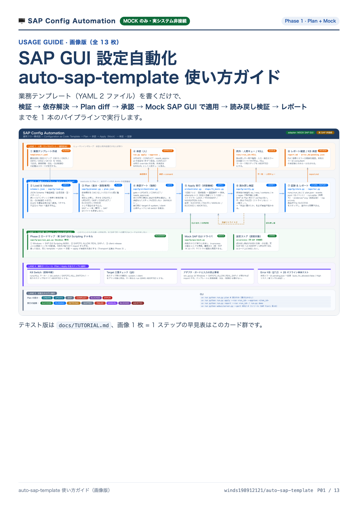](tutorial/cards/00_cover.png)

テンプレート（YAML 2 ファイル）を書くと、検証 → Plan diff → 承認 → Mock 適用 → 読み戻し検証 → レポートまで自動。

---

## 1. 全体像 — 5 分でわかる仕組み

[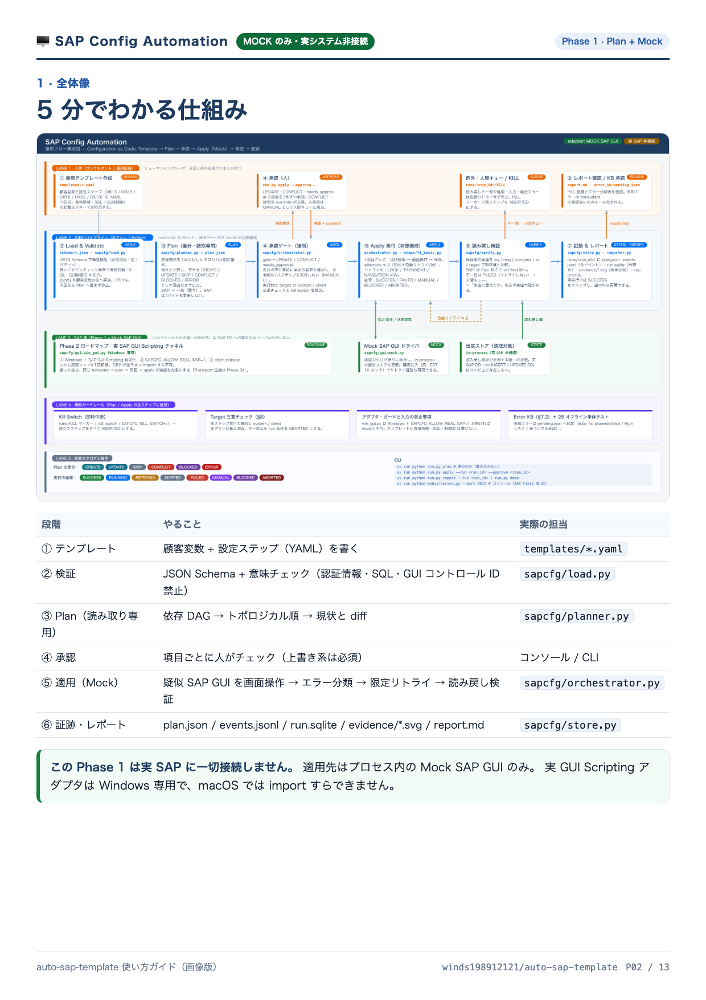](tutorial/cards/01_overview.png)

| 段階 | やること |
|---|---|
| ① テンプレート | 顧客変数 + 設定ステップ（YAML） |
| ② 検証 | JSON Schema + 禁止事項チェック |
| ③ Plan | 依存 DAG → diff（読み取り専用） |
| ④ 承認 | 項目ごとに人のチェック |
| ⑤ 適用（Mock） | 画面操作 → エラー分類 → リトライ → 読み戻し検証 |
| ⑥ 証跡 | plan.json / events.jsonl / run.sqlite / evidence / report.md |

---

## 2. 準備 — インストールと疎通確認（3 コマンド）

[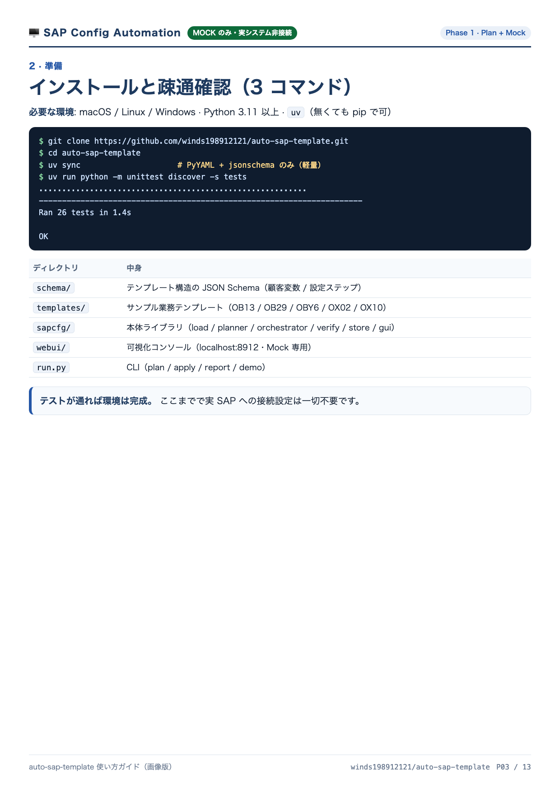](tutorial/cards/02_install.png)

```bash
git clone https://github.com/winds198912121/auto-sap-template.git
cd auto-sap-template && uv sync
uv run python -m unittest discover -s tests      # 26 tests / offline
```

---

## 3. 起動 — コンソールを開いて 60 秒で 1 周する

[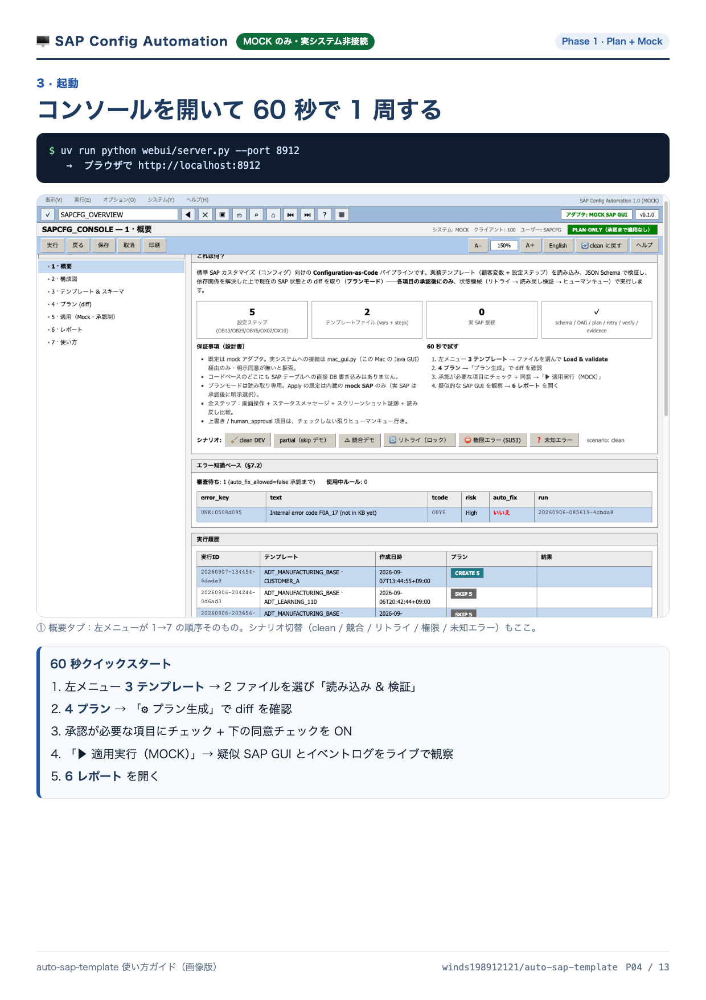](tutorial/cards/03_console.png)

```bash
uv run python webui/server.py --port 8912   # → http://localhost:8912
```

---

## 4. テンプレート読込 & スキーマ検証

[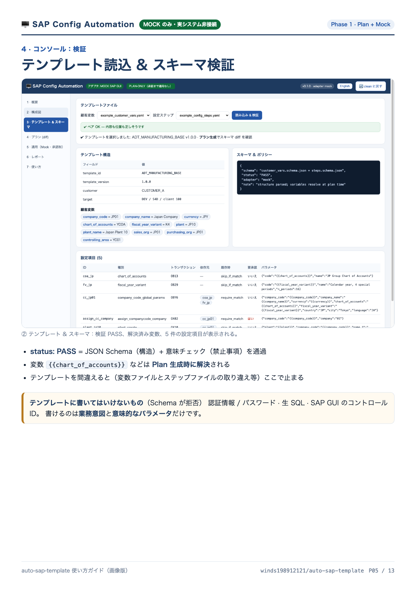](tutorial/cards/04_validate.png)

`PASS` = JSON Schema + 意味チェック通過。認証情報・生 SQL・GUI コントロール ID は書けません。

---

## 5. プラン（diff）の読み方

[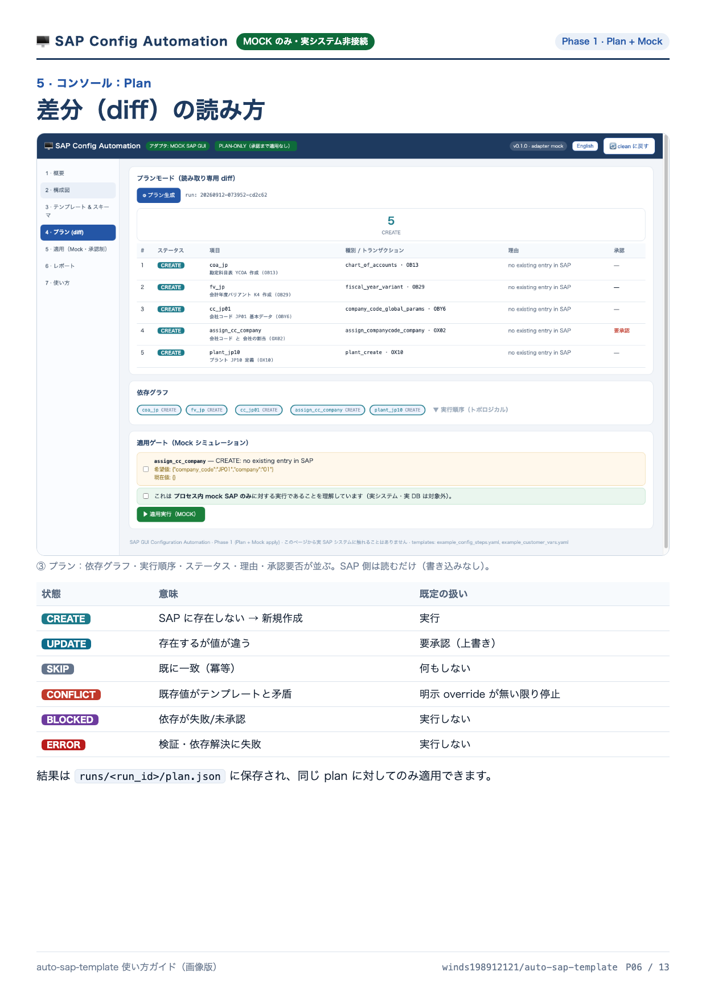](tutorial/cards/05_plan.png)

`CREATE` / `UPDATE`（要承認）/ `SKIP`（冪等）/ `CONFLICT` / `BLOCKED` / `ERROR`。
Plan は読み取り専用で、SAP 側を変更しません。

---

## 6. 承認ゲート — 人の承認が無い限り 1 ステップも動かない

[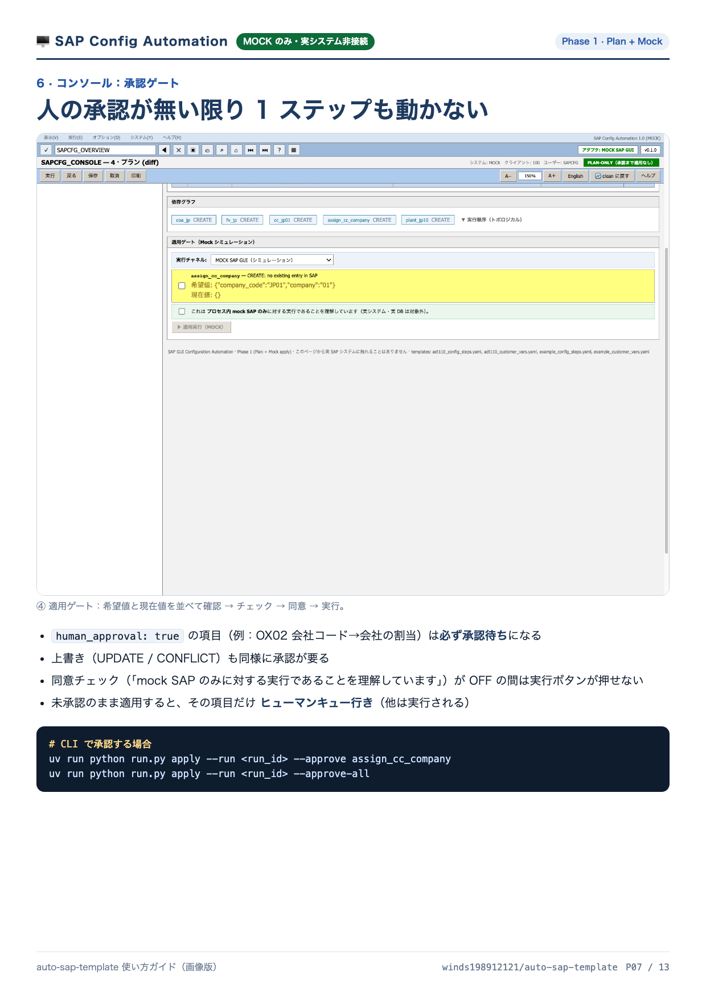](tutorial/cards/06_approval.png)

`human_approval: true` の項目と上書き系は必ず承認待ち。同意チェック OFF の間は実行ボタンが押せません。

---

## 7. 適用 — Mock SAP GUI を操作して読み戻して検証する

[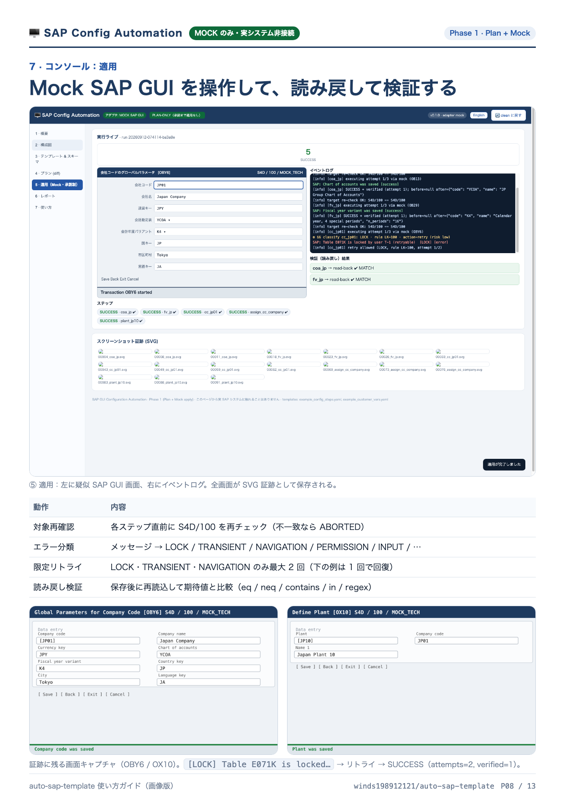](tutorial/cards/07_apply.png)

対象再確認 → エラー分類 → 限定リトライ（LOCK/TRANSIENT/NAVIGATION 最大 2 回）→ 読み戻し検証。
全画面が SVG 証跡として保存されます。

---

## 8. レポートと実行フォルダ（監査証跡）

[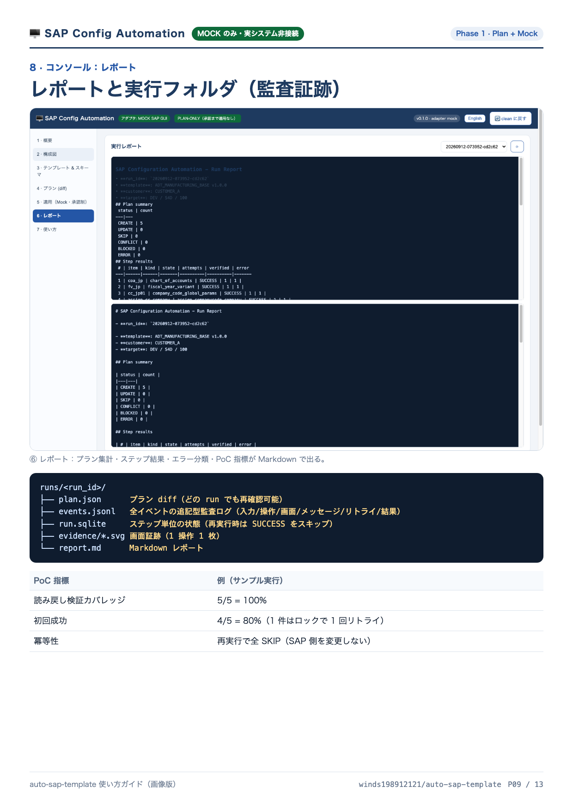](tutorial/cards/08_report.png)

```
runs/<run_id>/
├── plan.json      # プラン diff
├── events.jsonl   # 追記型の監査ログ
├── run.sqlite     # ステップ状態（再実行時は SUCCESS をスキップ）
├── evidence/*.svg # 画面証跡
└── report.md      # Markdown レポート
```

---

## 9. CLI — コンソールと同じ流れをコマンドで

[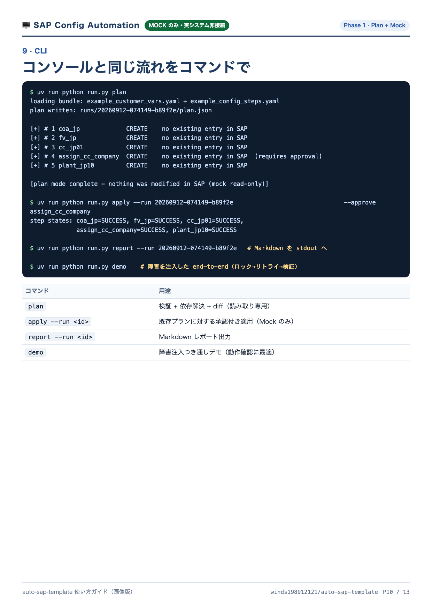](tutorial/cards/09_cli.png)

```bash
uv run python run.py plan                      # 読み取り専用 diff
uv run python run.py apply --run <id> --approve assign_cc_company
uv run python run.py report --run <id>
uv run python run.py demo                      # 障害注入つき通しデモ
```

---

## 10. 自分の案件テンプレートを作る

[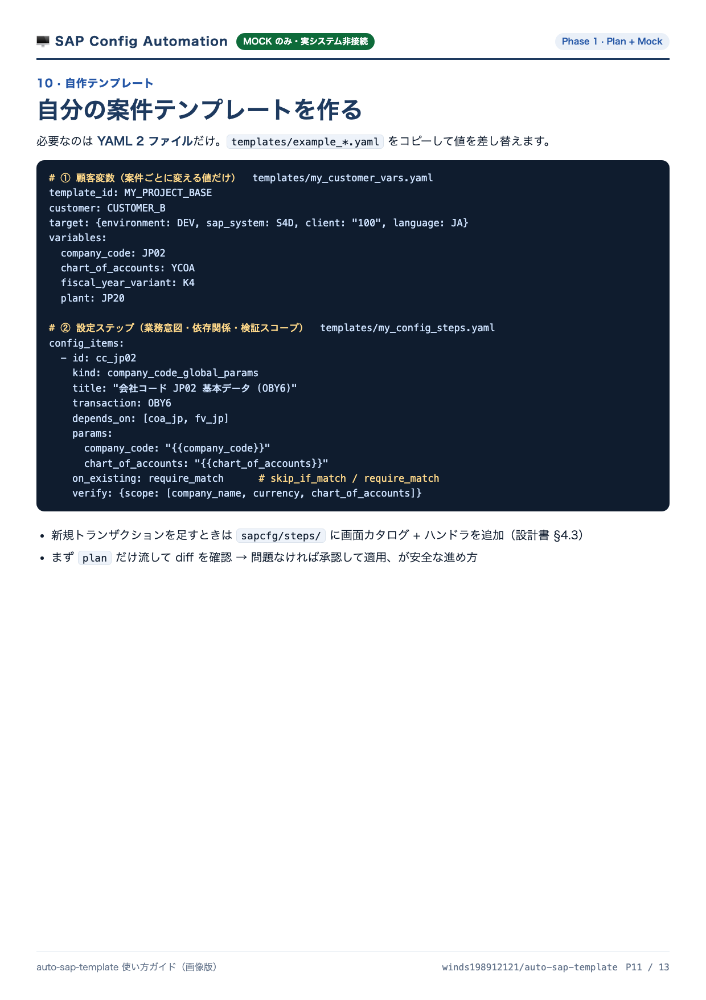](tutorial/cards/10_my_template.png)

`templates/example_*.yaml` をコピーして、顧客変数と設定ステップの 2 ファイルを書くだけ。

---

## 11. エラー分類と復旧 — どこまで自動で直すか

[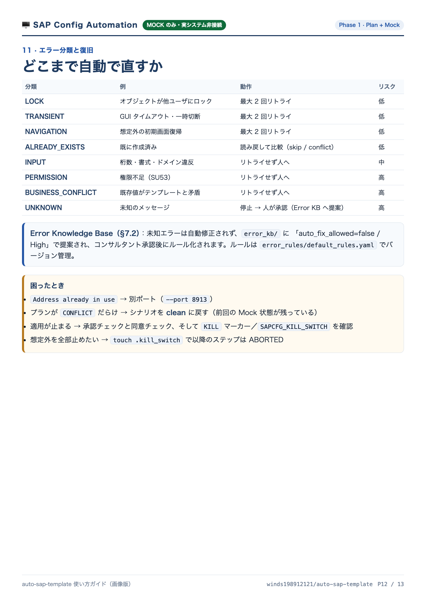](tutorial/cards/11_errors.png)

自動リトライは `LOCK` / `TRANSIENT` / `NAVIGATION` のみ。`PERMISSION` / `INPUT` /
`BUSINESS_CONFLICT` / `UNKNOWN` はリトライせず人へ回します（未知エラーは Error KB に提案）。

---

## 12. 安全設計と次の一歩

[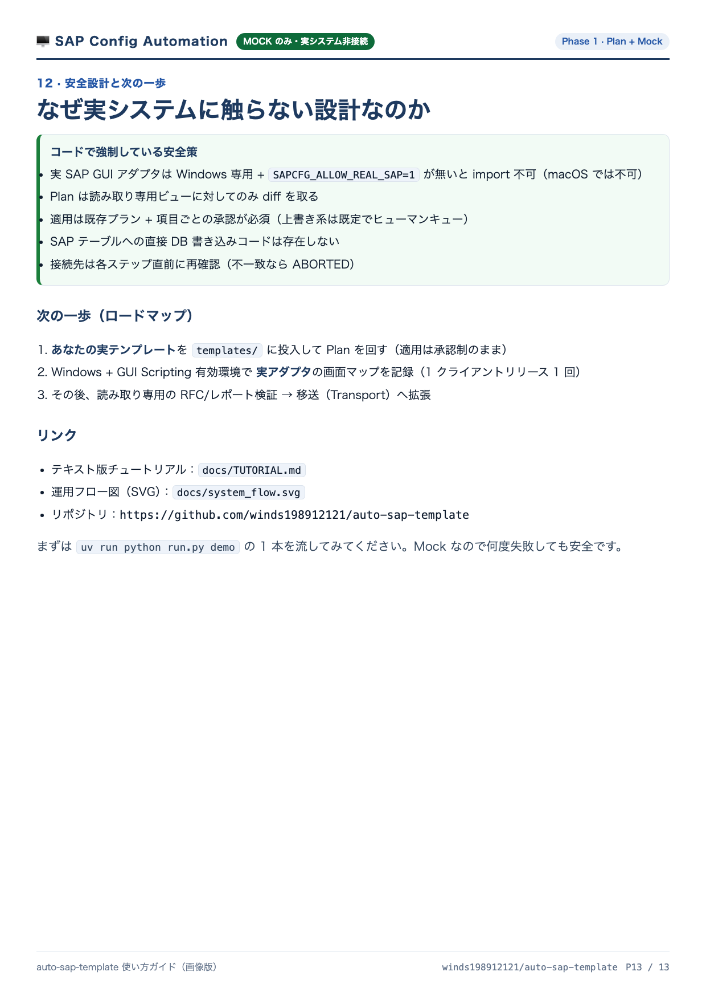](tutorial/cards/12_next.png)

---

## 実機スクリーンショット（コンソール全画面）

| 概要 | 構成図 |
|---|---|
|  |  |

| テンプレート検証 | プラン diff |
|---|---|
|  |  |

| 承認ゲート | 適用（ライブ） |
|---|---|
|  |  |

| 適用結果 | レポート |
|---|---|
| 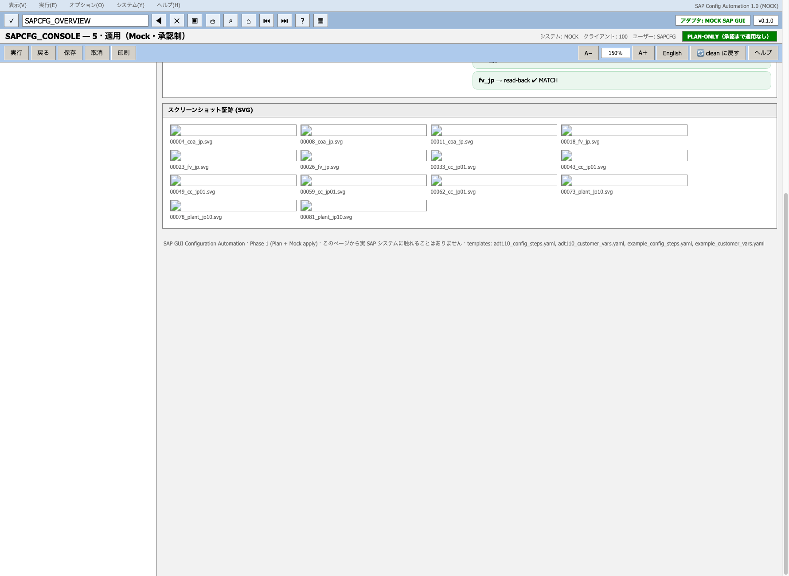 |  |

| 使い方タブ | 運用フロー図 |
|---|---|
| 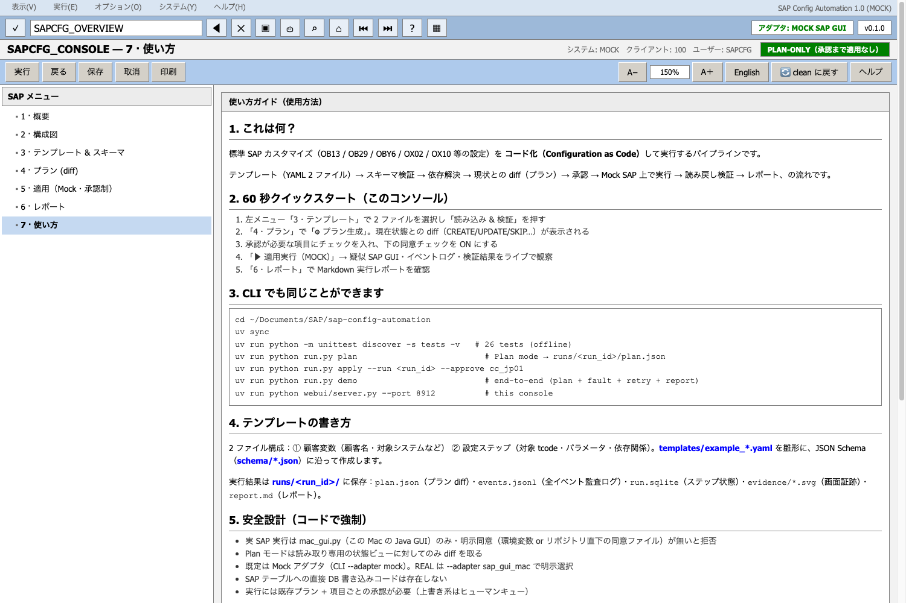 |  |

| 画面証跡 OBY6 | 画面証跡 OX10 |
|---|---|
|  |  |

---

リポジトリ: <https://github.com/winds198912121/auto-sap-template> ·
テキスト版: [TUTORIAL.md](TUTORIAL.md) ·
運用フロー図（SVG）: [system_flow.svg](system_flow.svg)
