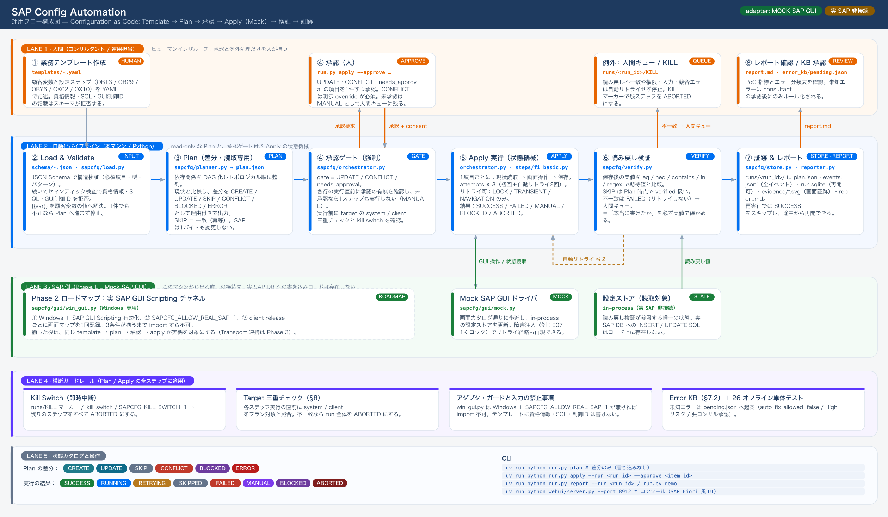
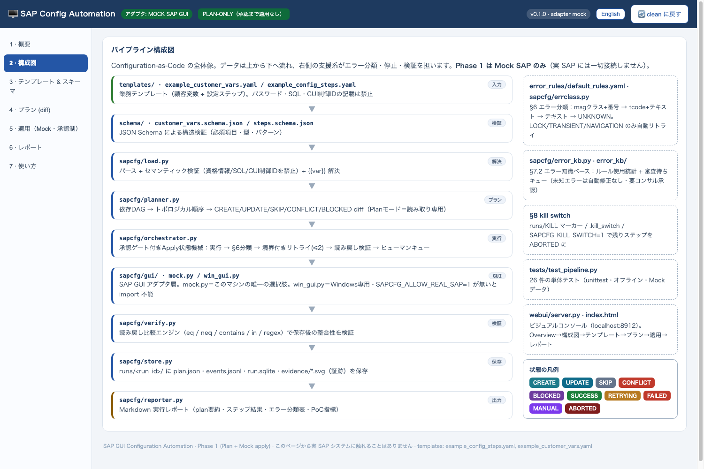
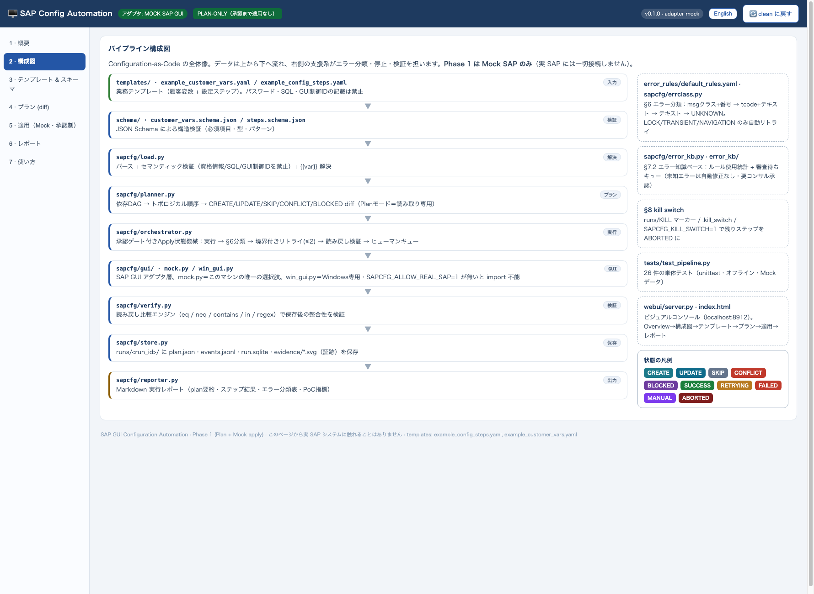
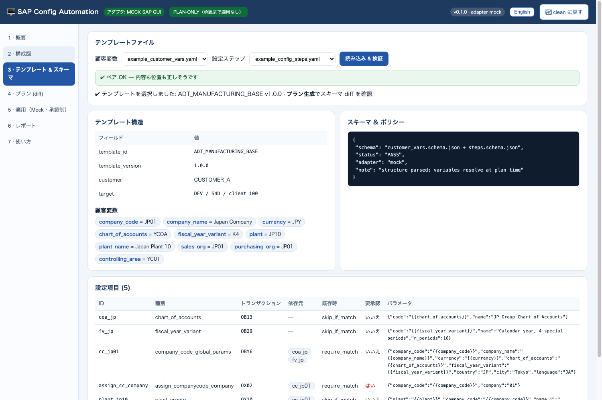
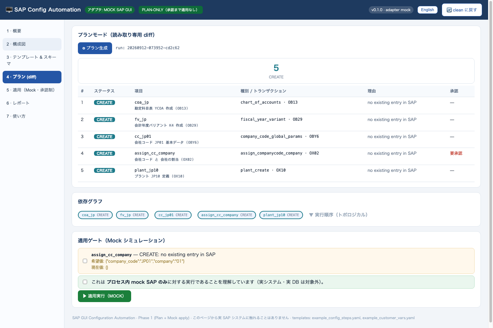
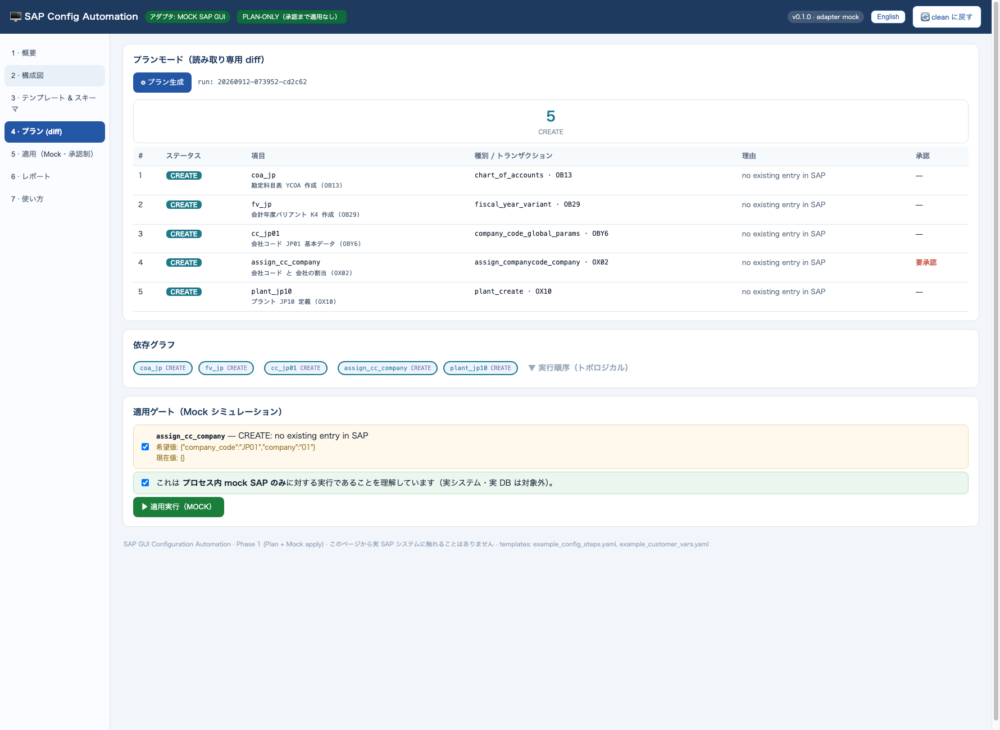
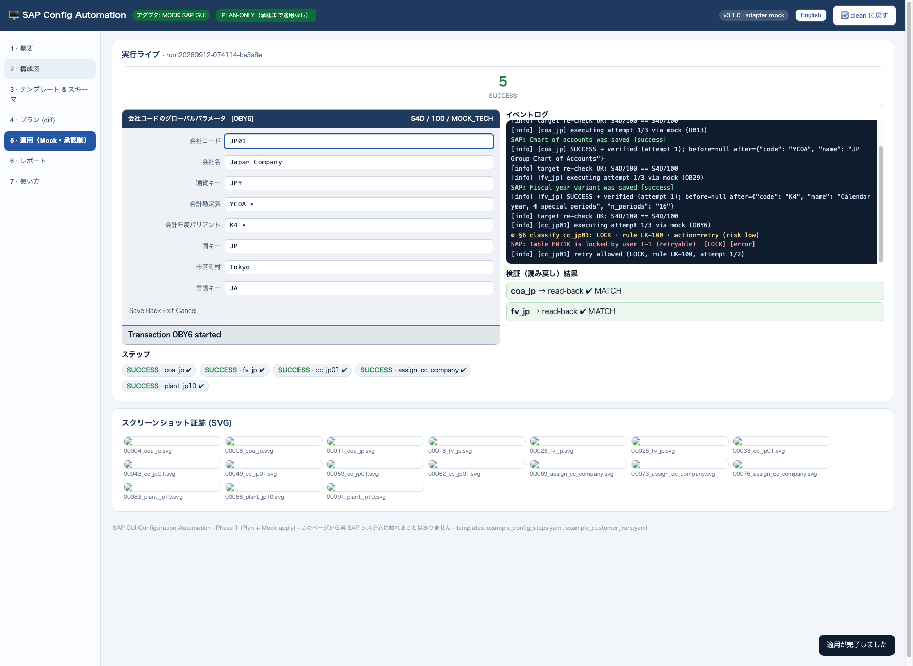
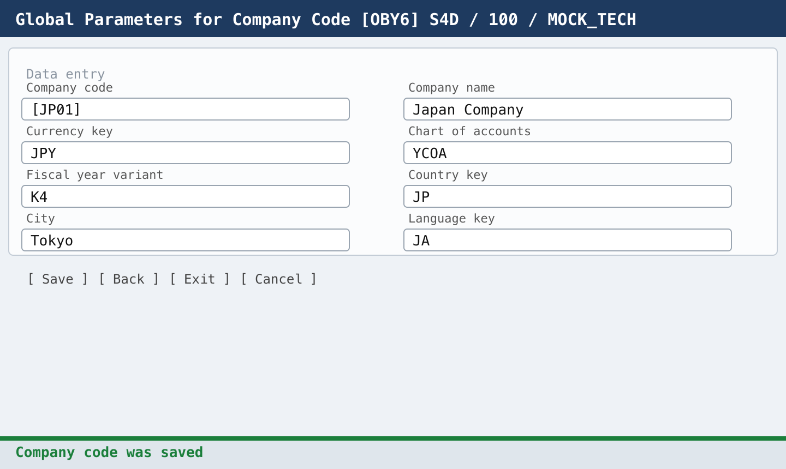
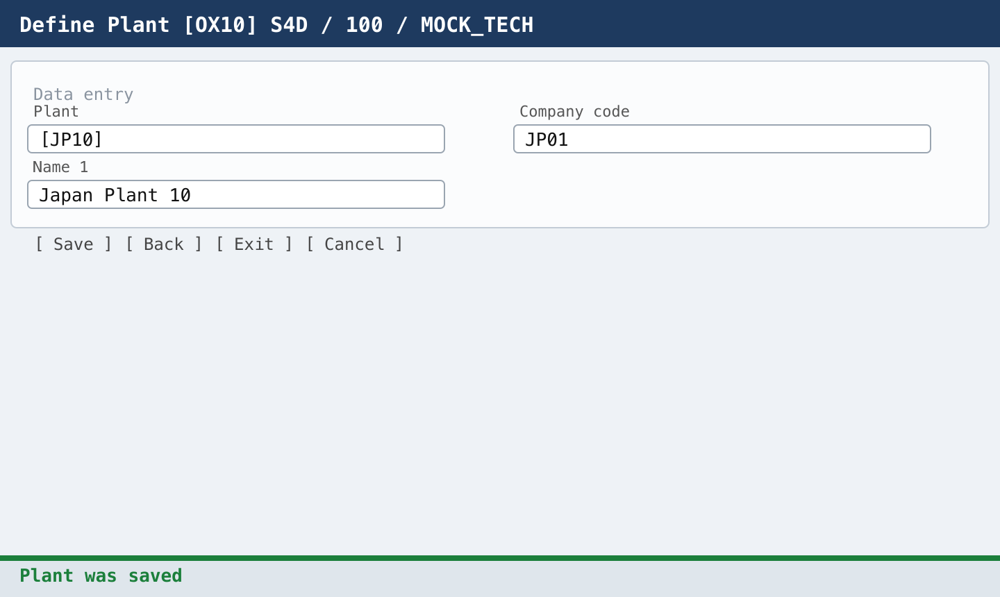
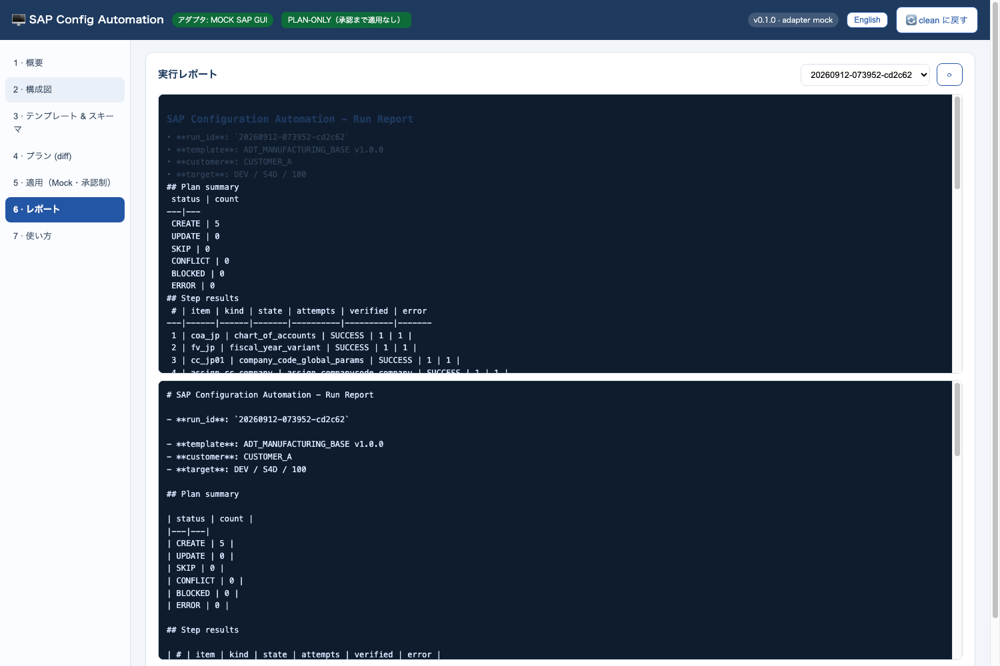

# 使い方チュートリアル（テキスト版）

**SAP GUI 設定自動化（Configuration as Code）— Phase 1: Plan + Mock**

テンプレート（YAML 2 ファイル）を書くと、**検証 → 依存解決 → Plan diff → 人の承認 → Mock SAP GUI での適用 →
エラー分類/限定リトライ → 読み戻し検証 → レポート**までを 1 本のパイプラインで実行します。

> 画像で読みたい場合は **[画像版チュートリアル（全 13 枚のカード）](TUTORIAL-IMAGES.md)** をどうぞ。
> 画像 1 枚 = 1 ステップで、この文書と同じ内容をカードにしたものです。

- 対象バージョン: `v0.1.0`（Phase 1 / Plan + Mock）
- スクリーンショット: 実際に動かしたコンソール（macOS, 2026-09-12 取得）
- **この Phase 1 は実 SAP システムに接続しません。** 適用先はプロセス内の Mock SAP GUI のみです。

---

## 目次

1. [これは何か（30 秒）](#1-これは何か30-秒)
2. [インストールと疎通確認](#2-インストールと疎通確認)
3. [60 秒クイックスタート（コンソール）](#3-60-秒クイックスタートコンソール)
4. [コンソールの画面別ガイド](#4-コンソールの画面別ガイド)
5. [CLI リファレンス](#5-cli-リファレンス)
6. [自分のテンプレートを作る](#6-自分のテンプレートを作る)
7. [実行結果（runs/）の読み方](#7-実行結果runsの読み方)
8. [エラー分類・リトライ・キルスイッチ](#8-エラー分類リトライキルスイッチ)
9. [トラブルシューティング](#9-トラブルシューティング)
10. [FAQ](#10-faq)
11. [安全設計（コードで強制）](#11-安全設計コードで強制)
12. [画像版カード一覧](#12-画像版カード一覧)

---

## 1. これは何か（30 秒）



| 段階 | やること | 担当コード |
|---|---|---|
| ① テンプレート | 顧客変数 + 設定ステップ（YAML）を書く | `templates/*.yaml` |
| ② 検証 | JSON Schema + 意味チェック（認証情報・生 SQL・GUI コントロール ID を拒否） | `sapcfg/load.py` |
| ③ Plan（読み取り専用） | 依存 DAG → トポロジカル順 → 現在状態との diff | `sapcfg/planner.py` |
| ④ 承認 | 項目ごとに人がチェック（上書き系・`human_approval` は必須） | コンソール / CLI |
| ⑤ 適用（Mock） | 疑似 SAP GUI を操作 → エラー分類 → 限定リトライ → 読み戻し検証 | `sapcfg/orchestrator.py` |
| ⑥ 証跡・レポート | `plan.json` / `events.jsonl` / `run.sqlite` / `evidence/*.svg` / `report.md` | `sapcfg/store.py` |

サンプルテンプレートは **OB13（勘定科目表）/ OB29（会計年度バリアント）/ OBY6（会社コード基本データ）/
OX02（会社コード→会社の割当）/ OX10（プラント定義）** の 5 ステップです。

---

## 2. インストールと疎通確認

**必要な環境**: macOS / Linux / Windows · Python 3.11 以上 · [`uv`](https://docs.astral.sh/uv/)（pip でも可）

```bash
$ git clone https://github.com/winds198912121/auto-sap-template.git
$ cd auto-sap-template
$ uv sync                                              # PyYAML + jsonschema のみ
$ uv run python -m unittest discover -s tests          # 26 tests / offline / ~1.4s
..........................................................
----------------------------------------------------------------------
Ran 26 tests in 1.439s

OK
```

`uv` を使わない場合:

```bash
$ python3 -m venv .venv && source .venv/bin/activate
$ pip install PyYAML jsonschema
$ python -m unittest discover -s tests
```

| ディレクトリ | 中身 |
|---|---|
| `schema/` | テンプレート構造の JSON Schema（`customer_vars` / `steps`） |
| `templates/` | サンプル業務テンプレート（YAML 2 ファイル） |
| `sapcfg/` | 本体ライブラリ（`load` / `planner` / `orchestrator` / `errclass` / `verify` / `store` / `reporter` / `gui`） |
| `sapcfg/gui/mock.py` | 疑似 SAP GUI ドライバ（障害注入つき） |
| `webui/` | 可視化コンソール（localhost:8912・**Mock 専用**） |
| `run.py` | CLI（`plan` / `apply` / `report` / `demo`） |
| `error_rules/default_rules.yaml` | 承認済みエラーホワイトリスト（バージョン管理） |

---

## 3. 60 秒クイックスタート（コンソール）

```bash
$ uv run python webui/server.py --port 8912
   → ブラウザで http://localhost:8912
```



左メニューの順序がそのまま作業順です。

1. **3 テンプレート & スキーマ** → 2 ファイルを選び「読み込み & 検証」
2. **4 プラン** → 「⚙ プラン生成」で diff を確認
3. 承認が必要な項目にチェック + 下の同意チェックを ON
4. **「▶ 適用実行（MOCK）」** → 疑似 SAP GUI とイベントログをライブで観察
5. **6 レポート** を開く

> コンソール内の **7 使い方** タブにも同じ手順が書かれています（`09_guide.png`）。
> シナリオボタン（clean / partial / 競合 / リトライ / 権限 / 未知エラー）で Mock の挙動を切り替えられます。

CLI だけで通しで試すなら、これ 1 本が最短です。

```bash
$ uv run python run.py demo
```

ロック障害を注入して「リトライ → 読み戻し検証 → レポート」まで走ります。

---

## 4. コンソールの画面別ガイド

### 4.1 概要（1 · 概要）


- KPI: 設定ステップ数・テンプレートファイル数・**実 SAP 接続数 = 0**
- 保証事項（実システム非接続 / 直接 DB 書き込みなし / Plan は読み取り専用 / 全画面証跡 / 承認制）
- シナリオ切替と実行履歴

### 4.2 構成図（2 · 構成図）



パイプラインの構成と、Mock アダプタがどこに挟まるかを図で確認できます
（元データは [`docs/system_flow.svg`](system_flow.svg)）。

### 4.3 テンプレート & スキーマ（3 · テンプレート）



- `status: PASS` = JSON Schema（構造）+ 意味チェック（禁止事項）を通過
- `{{chart_of_accounts}}` などの変数は **Plan 生成時に解決**されます
- 5 件の設定項目（tcode / 種別 / 既存時の扱い / 承認要否）が一覧表示

**テンプレートに書いてはいけないもの**（Schema が拒否）: 認証情報・パスワード / 生 SQL /
SAP GUI のコントロール ID。書けるのは **業務意図** と **意味的なパラメータ** だけです。

### 4.4 プラン（4 · プラン）



Plan モードは **読み取り専用**（`SapStateView`）で、SAP 側を一切変更しません。

| 状態 | 意味 | 既定の扱い |
|---|---|---|
| `CREATE` | SAP に存在しない → 新規作成 | 実行 |
| `UPDATE` | 存在するが値が違う | 要承認（上書き） |
| `SKIP` | 既に一致（冪等） | 何もしない |
| `CONFLICT` | 既存値がテンプレートと矛盾 | 明示 override が無い限り停止 |
| `BLOCKED` | 依存が失敗 / 未承認 | 実行しない |
| `ERROR` | 検証・依存解決に失敗 | 実行しない |

結果は `runs/<run_id>/plan.json` に保存され、**適用はこのプランに対してのみ**行われます。
画面下には依存グラフと実行順序（トポロジカルソート）も表示されます。

### 4.5 承認ゲート（4 · プラン下部）



- `human_approval: true` の項目（例: OX02 会社コード→会社の割当）は **必ず承認待ち**
- 上書き（`UPDATE`）も同様に承認が必要
- 「mock SAP のみに対する実行であることを理解しています」の同意チェックが OFF の間は実行ボタンが押せません
- 未承認のまま適用すると、その項目だけ **ヒューマンキュー行き**（他は実行される）

### 4.6 適用（5 · 適用（Mock・承認制））



左が疑似 SAP GUI（入力フィールド / ボタン / ステータスバー）、右がイベントログ、下が検証結果と
SVG 画面証跡です。

| 動作 | 内容 |
|---|---|
| 対象再確認 | 各ステップ直前に `S4D/100` を再チェック（不一致なら `ABORTED`） |
| エラー分類 | メッセージ → `LOCK` / `TRANSIENT` / `NAVIGATION` / `PERMISSION` / `INPUT` / … |
| 限定リトライ | `LOCK`・`TRANSIENT`・`NAVIGATION` のみ最大 2 回 |
| 読み戻し検証 | 保存後に再読込して期待値と比較（`eq` / `neq` / `contains` / `in` / `regex`） |

証跡として残る画面キャプチャの例（OBY6 / OX10）:

| OBY6 会社コード基本データ | OX10 プラント定義 |
|---|---|
|  |  |

### 4.7 レポート（6 · レポート）



Markdown レポートには、プラン集計・ステップ結果（attempts / verified）・エラー分類・
PoC 指標（読み戻し検証カバレッジ / 初回成功率 / 冪等性）・証跡一覧が入ります。

---

## 5. CLI リファレンス

```bash
# 1) Plan モード（読み取り専用 diff）→ runs/<run_id>/plan.json
$ uv run python run.py plan
loading bundle: example_customer_vars.yaml + example_config_steps.yaml
plan written: runs/20260912-074149-b89f2e/plan.json

[+] # 1 coa_jp             CREATE    no existing entry in SAP
[+] # 2 fv_jp              CREATE    no existing entry in SAP
[+] # 3 cc_jp01            CREATE    no existing entry in SAP
[+] # 4 assign_cc_company  CREATE    no existing entry in SAP  (requires approval)
[+] # 5 plant_jp10         CREATE    no existing entry in SAP

[plan mode complete - nothing was modified in SAP (mock read-only)]

# 2) 承認付き適用（Mock のみ）
$ uv run python run.py apply --run 20260912-074149-b89f2e --approve assign_cc_company
step states: coa_jp=SUCCESS, fv_jp=SUCCESS, cc_jp01=SUCCESS,
             assign_cc_company=SUCCESS, plant_jp10=SUCCESS

# 3) レポートを stdout へ
$ uv run python run.py report --run 20260912-074149-b89f2e

# 4) 障害注入つき end-to-end（動作確認に最適）
$ uv run python run.py demo
```

| コマンド | 用途 | 主なオプション |
|---|---|---|
| `plan` | 検証 + 依存解決 + diff（読み取り専用） | `--vars` / `--steps` |
| `apply` | 既存プランに対する承認付き適用 | `--run <id>` / `--approve a,b` / `--approve-all` |
| `report` | Markdown レポート出力 | `--run <id>` |
| `demo` | ロック → リトライ → 検証の通しデモ | — |
| （共通） | アダプタ指定 | `--adapter mock`（**現状これのみ**） |

---

## 6. 自分のテンプレートを作る

必要なのは **YAML 2 ファイル**だけです。`templates/example_*.yaml` をコピーして値を差し替えます。

### ① 顧客変数ファイル（`templates/*_customer_vars.yaml`）

```yaml
template_id: MY_PROJECT_BASE
template_version: 1.0.0
customer: CUSTOMER_B
target:
  environment: DEV
  sap_system: S4D
  client: "100"
  language: JA
variables:
  company_code: JP02
  company_name: Japan Company 2
  currency: JPY
  chart_of_accounts: YCOA
  fiscal_year_variant: K4
  plant: JP20
```

### ② 設定ステップファイル（`templates/*_config_steps.yaml`）

```yaml
template_id: MY_PROJECT_BASE
template_version: 1.0.0
target: {environment: DEV, sap_system: S4D, client: "100"}
config_items:
  - id: cc_jp02
    kind: company_code_global_params
    title: "会社コード JP02 基本データ (OBY6)"
    transaction: OBY6
    depends_on: [coa_jp, fv_jp]          # 依存 DAG（実行順は自動ソート）
    params:
      company_code: "{{company_code}}"   # 変数は顧客変数ファイルから解決
      chart_of_accounts: "{{chart_of_accounts}}"
    on_existing: require_match           # skip_if_match / require_match
    verify:
      scope: [company_name, currency, chart_of_accounts]   # 読み戻し検証の対象列
    # human_approval: true               # 上書き・横断割当は承認必須にする
```

ポイント:

- **`on_existing`**: 既存時に「一致ならスキップ」か「一致を必須とする（違えば CONFLICT）」を選ぶ
- **`verify.scope`**: 保存後に読み戻して比較する列。ここがそのまま検証カバレッジになります
- **`depends_on`**: 依存を書くだけで実行順が決まり、依存失敗時は `BLOCKED` になります
- 新しいトランザクションを追加するときは `sapcfg/steps/` に画面カタログ + ハンドラを追加（設計書 §4.3）
- 進め方: まず `plan` だけ流して diff を確認 → 問題なければ承認して適用

---

## 7. 実行結果（`runs/`）の読み方

```
runs/<run_id>/
├── plan.json      # プラン diff（どの run でも再確認できる）
├── events.jsonl   # 追記型の監査ログ（入力 / 操作 / 画面 / メッセージ / リトライ / 結果）
├── run.sqlite     # ステップ単位の状態（再実行時は SUCCESS をスキップ = 冪等）
├── evidence/*.svg # 画面証跡（1 操作 1 枚。PNG 化も可能）
└── report.md      # Markdown レポート
```

`events.jsonl` の例（1 行 = 1 イベント）:

```json
{"seq": 45, "type": "error_classify", "payload": {"item": "cc_jp01", "kind": "LOCK",
 "key": "LK-100", "action": "retry", "retry_max": 2, "risk": "low",
 "text": "Table E071K is locked by user T-1 (retryable)"}}
```

レポートの PoC 指標（サンプル実行）:

| 指標 | 値 | 目標 |
|---|---|---|
| 読み戻し検証カバレッジ | 5/5 = 100% | 100% |
| 初回成功（first-try success） | 4/5 = 80% | ≥ 80% |
| 冪等性 | 再実行で全 `SKIP` | 必須 |

---

## 8. エラー分類・リトライ・キルスイッチ

判定順序は **メッセージクラス + 番号 → tcode + テキスト → テキスト → クラス → UNKNOWN** です。

| 分類 | 例 | 動作 | リスク |
|---|---|---|---|
| `LOCK` | オブジェクトが他ユーザにロック | 最大 2 回リトライ | 低 |
| `TRANSIENT` | GUI タイムアウト・一時切断 | 最大 2 回リトライ | 低 |
| `NAVIGATION` | 想定外の初期画面復帰 | 最大 2 回リトライ | 低 |
| `ALREADY_EXISTS` | 既に作成済み | 読み戻して比較（skip / conflict） | 低 |
| `INPUT` | 桁数・書式・ドメイン違反 | リトライせず人へ | 中 |
| `PERMISSION` | 権限不足（SU53） | リトライせず人へ | 高 |
| `BUSINESS_CONFLICT` | 既存値がテンプレートと矛盾 | リトライせず人へ | 高 |
| `UNKNOWN` | 未知のメッセージ | 停止 → 人が承認（Error KB へ提案） | 高 |

- **Error Knowledge Base（§7.2）**: 未知エラーは自動修正されず `error_kb/` に
  「`auto_fix_allowed=false` / High」で提案され、コンサルタント承認後にルール化されます。
- ルール本体は `error_rules/default_rules.yaml`（バージョン管理・レビュー対象）。
- **キルスイッチ**（緊急停止）: 実行中に `KILL` マーカー、プロジェクト直下の `.kill_switch`、
  または環境変数 `SAPCFG_KILL_SWITCH=1` のいずれかで、以降のステップは `ABORTED` になります。

---

## 9. トラブルシューティング

| 症状 | 原因 / 対処 |
|---|---|
| `OSError: [Errno 48] Address already in use` | 8912 が使用中 → `--port 8913` で起動 |
| プランが `CONFLICT` だらけ | 前回の Mock 状態が残っている → シナリオを **clean** に戻して再プラン |
| 「適用実行」ボタンが押せない | 同意チェック（または承認チェック）が OFF |
| 適用後に `human queue` が残る | 未承認項目がある → `--approve <item_id>` / `--approve-all` で再実行 |
| `template files not found` | `--vars` / `--steps` のパス指定ミス（既定は `templates/example_*.yaml`） |
| Schema エラーで読込が止まる | `schema/*.json` に反する記述（禁止: 認証情報 / 生 SQL / GUI コントロール ID） |
| 途中で全ステップ `ABORTED` | `KILL` マーカー / `.kill_switch` / `SAPCFG_KILL_SWITCH=1` を確認 |
| 実 SAP に繋ぎたい | Phase 1 では不可（Windows + `SAPCFG_ALLOW_REAL_SAP=1` が前提。macOS では import 不可） |

---

## 10. FAQ

**Q1. 実 SAP システムに接続して設定を変更できますか？**
いいえ。Phase 1 はコンソールも CLI も Mock アダプタ専用です。実 GUI Scripting アダプタは Windows 専用で、
`SAPCFG_ALLOW_REAL_SAP=1` を明示しない限り import すらできません。

**Q2. Excel の設定書を取り込めますか？**
現状は YAML / JSON のみです（Excel 取り込みはロードマップ）。まずは Excel の値を `variables:` に写すのが早いです。

**Q3. 途中で失敗したら最初からやり直しですか？**
いいえ。ステップ状態は `run.sqlite` に保存され、再実行すると `SUCCESS` はスキップされます（冪等）。
`runs/<run_id>` を指定して再開します。

**Q4. 失敗した適用を元に戻せますか？**
自動ロールバックは未実装です（Phase 1 の範囲外）。だからこそ Plan → 承認 → 限定リトライ →
読み戻し検証という順序と、全画面証跡・イベントログを残す設計になっています。

**Q5. 自分のトランザクション（例: OBYC, VKOA）を追加できますか？**
可能です。`sapcfg/steps/` に画面カタログとハンドラを追加し、テンプレートに `kind` / `transaction` を書きます。

**Q6. 本番（PRD）でも使えますか？**
Phase 1 の適用先は Mock のみです。実システム運用は、実アダプタの整備 → 読み取り専用検証 →
移送（Transport）連携という順で段階的に拡張する想定です。

---

## 11. 安全設計（コードで強制）

| ルール | 実装箇所 |
|---|---|
| 実 SAP アダプタは Windows 専用 + 明示許可が必要 | `sapcfg/gui/win_gui.py`（`SAPCFG_ALLOW_REAL_SAP=1` が無ければ例外） |
| Plan モードは読み取り専用 | `planner.build_plan` は読み取り専用の `SapStateView` のみ受け取る |
| 適用は既存プラン + 項目ごとの承認が必須 | `orchestrator._run_item` のゲート（未承認はヒューマンキュー） |
| SAP テーブルへの直接 DB 書き込みなし | コードベースに SAP テーブルへの INSERT/UPDATE SQL は存在しない |
| 接続先の三重チェック | 各ステップ直前に system/client をプランの対象と照合（不一致で `ABORTED`） |
| 緊急停止 | `KILL` マーカー / `.kill_switch` / `SAPCFG_KILL_SWITCH=1` |

---

## 12. 画像版カード一覧

SNS / 社内共有向けに、この文書を **1 枚 = 1 ステップのカード画像** にしたものがあります。

➡️ **[画像版チュートリアル（TUTORIAL-IMAGES.md）](TUTORIAL-IMAGES.md)**

| # | カード | # | カード |
|---|---|---|---|
| 0 | 表紙 | 7 | 適用（Mock SAP GUI） |
| 1 | 全体像 | 8 | レポートと証跡 |
| 2 | 準備・インストール | 9 | CLI リファレンス |
| 3 | コンソール起動 | 10 | 自作テンプレート |
| 4 | テンプレート検証 | 11 | エラー分類と復旧 |
| 5 | プラン diff | 12 | 安全設計と次の一歩 |
| 6 | 承認ゲート | — | — |

カードは [`docs/tutorial/build_cards.py`](tutorial/build_cards.py) で再生成できます（Chrome ヘッドレス）。

```bash
$ python3 docs/tutorial/build_cards.py    # → docs/tutorial/cards/*.png
```
